# 🔄 HIMS 2.0 — Complete Flow Documentation
## Every Workflow in the Dental Hospital Management System

---

## Table of Contents
1. [System Entry & Authentication](#1-system-entry--authentication)
2. [Patient Registration (New)](#2-patient-registration-new-patient)
3. [Patient Revisit / Follow-up](#3-patient-revisit--follow-up)
4. [Appointment Booking & Check-in](#4-appointment-booking--check-in)
5. [OPD Consultation (Doctor Flow)](#5-opd-consultation-doctor-flow)
6. [Dental Treatment Planning](#6-dental-treatment-planning)
7. [Case Sheet Documentation](#7-case-sheet-documentation)
8. [OPD Billing](#8-opd-billing)
9. [IPD Admission](#9-ipd-admission)
10. [IPD Daily Clinical Care](#10-ipd-daily-clinical-care)
11. [Discharge](#11-discharge-flow)
12. [Emergency](#12-emergency-flow)
13. [Lab Test Flow](#13-lab-test-flow)
14. [Procedure & OT Flow](#14-procedure--ot-flow)
15. [Dispensary / Pharmacy](#15-dispensary--pharmacy-flow)
16. [Billing Lifecycle (Cancel / Refund)](#16-billing-lifecycle)
17. [Inventory & Procurement](#17-inventory--procurement-flow)
18. [Employee Onboarding](#18-employee-onboarding)
19. [Attendance & Leave](#19-attendance--leave-flow)
20. [Payroll](#20-payroll-flow)
21. [Camp Management](#21-camp-management-flow)
22. [Counseling & Enquiry](#22-counseling--enquiry-flow)
23. [MIS & Reports](#23-mis--reports-flow)
24. [End-to-End Patient Journey](#24-end-to-end-patient-journey)

---

## 1. System Entry & Authentication

**Actor:** Any User  
**Pages:** [Login.aspx](file:///F:/HIMS2.0/Login.aspx) → [Default.aspx](file:///F:/HIMS2.0/Default.aspx) → [HIMS.Master](file:///F:/HIMS2.0/HIMS.Master)

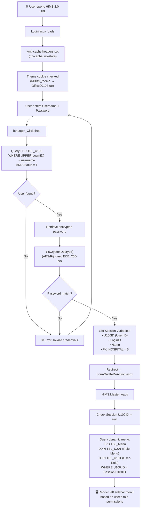

### Lock & Unlock Flow
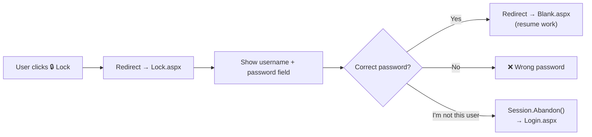

---

## 2. Patient Registration (New Patient)

**Actor:** Receptionist  
**Page:** [FormGridOPDRec.aspx](file:///F:/HIMS2.0/FormGridOPDRec.aspx)

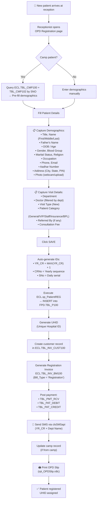

---

## 3. Patient Revisit / Follow-up

**Actor:** Receptionist  
**Page:** [FormGridOPDReZ.aspx](file:///F:/HIMS2.0/FormGridOPDReZ.aspx)

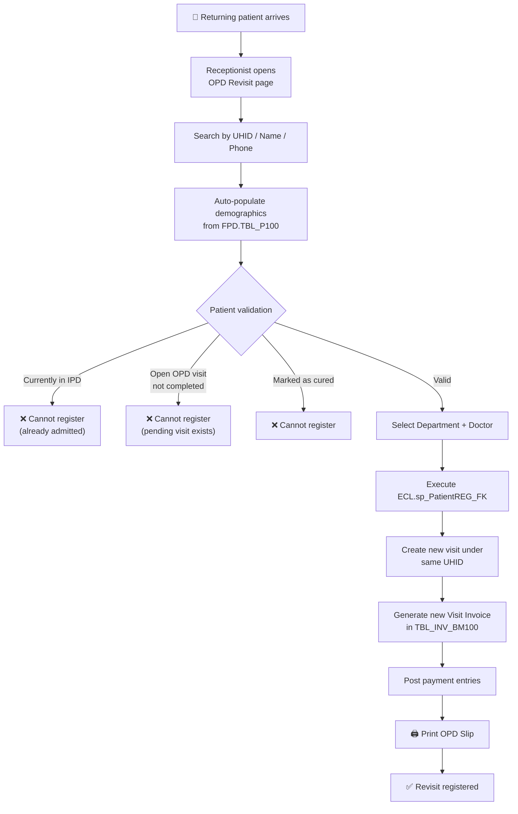

---

## 4. Appointment Booking & Check-in

**Actor:** Receptionist → Patient → Doctor  
**Page:** [FormGridAppointmentREC.aspx](file:///F:/HIMS2.0/FormGridAppointmentREC.aspx)

```mermaid
flowchart TD
    A["📞 Patient calls / walks in<br/>for appointment"] --> B["Receptionist opens<br/>Appointment page"]
    B --> C{Existing patient?}
    C -->|No| D["Quick registration first"]
    C -->|Yes| E["Search patient by UHID/Name"]
    D --> E

    E --> F["Select Department"]
    F --> G["System loads doctors<br/>for department with<br/>current patient load count"]
    G --> H["Select Doctor"]
    H --> I["View available date/time slots<br/>(based on doctor roster +<br/>existing appointments)"]
    I --> J["Select slot + set type:<br/>• Consultation<br/>• Follow-up<br/>• Procedure"]
    J --> K["Set Priority:<br/>Normal / Urgent"]
    K --> L["Save appointment<br/>→ INSERT ECL.TBL_Appointment"]
    L --> M["Auto-generate Token Number"]
    M --> N["📱 SMS confirmation sent"]
    N --> O["✅ Appointment Booked"]

    O --> P["🏥 DAY OF VISIT"]
    P --> Q["Patient arrives"]
    Q --> R{New or Old patient?}
    R -->|New| S["Flag: NEW Patient"]
    R -->|Old| T["Flag: OLD Patient<br/>(show last visit date)"]
    S --> U["Assign Senior Doctor<br/>(FK_U200 = 2)"]
    T --> U
    U --> V["Assign PG/Junior Doctor<br/>(FK_U200 = 16)"]
    V --> W["Assign Intern (optional)"]
    W --> X["Click CHECK-IN"]
    X --> Y["UPDATE TBL_Appointment:<br/>• CheckIn = 1<br/>• AppointmentDate = NOW<br/>• RPT_FLG (repeat flag)"]
    Y --> Z["✅ Patient checked in<br/>→ Appears in Doctor's queue"]
```

### Appointment Status Flow
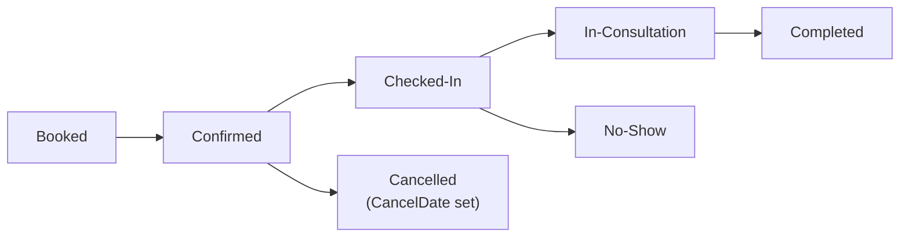

---

## 5. OPD Consultation (Doctor Flow)

**Actor:** Doctor  
**Pages:** [FormGridOPD.aspx](file:///F:/HIMS2.0/FormGridOPD.aspx) → [FormGridCaseSheet.aspx](file:///F:/HIMS2.0/FormGridCaseSheet.aspx) → [FormGridPGTreatment.aspx](file:///F:/HIMS2.0/FormGridPGTreatment.aspx)

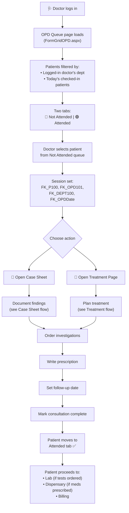

---

## 6. Dental Treatment Planning

**Actor:** PG Doctor → Senior Doctor (Approval)  
**Page:** [FormGridPGTreatment.aspx](file:///F:/HIMS2.0/FormGridPGTreatment.aspx) *(Largest module: 281KB)*

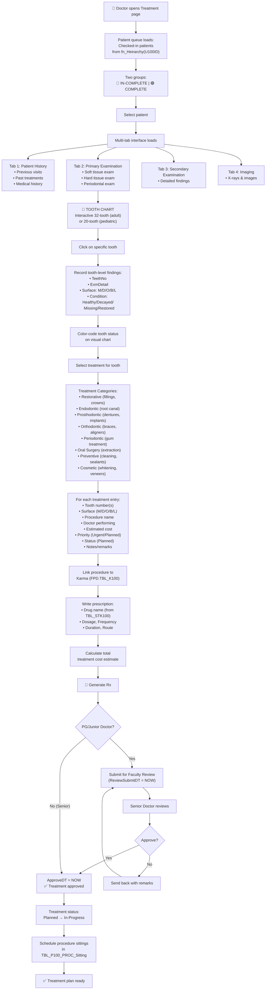

### Treatment Status Lifecycle
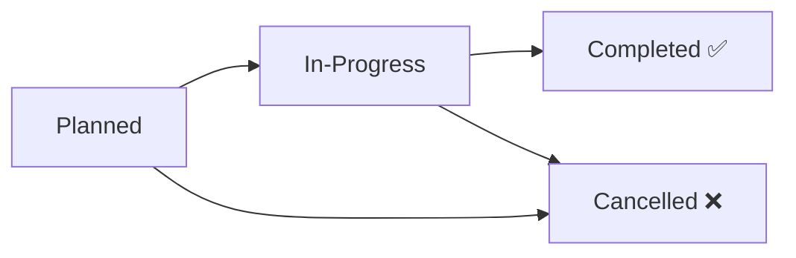

---

## 7. Case Sheet Documentation

**Actor:** Doctor  
**Page:** [FormGridCaseSheet.aspx](file:///F:/HIMS2.0/FormGridCaseSheet.aspx)

```mermaid
flowchart TD
    A["📝 Doctor opens Case Sheet"] --> B["Patient context loaded<br/>from session"]

    B --> C["Section 1: Chief Complaint<br/>→ FPD.TBL_CS101_Case"]
    C --> D["Section 2: History<br/>• HPI (History of Present Illness)<br/>• Past Medical History<br/>• Past Dental History 🦷<br/>• Family History<br/>• Personal History (habits:<br/>  smoking, alcohol, tobacco)<br/>• Drug History / Allergies"]

    D --> E["Section 3: General Physical Exam<br/>→ FPD.TBL_CS101_GPExam<br/>• Vitals: BP, Pulse, Temp, SpO2<br/>• Height, Weight → BMI<br/>• Anemia, Jaundice, Edema<br/>• Lymphadenopathy"]

    E --> F["Section 4: Systemic Examination<br/>→ FPD.TBL_CS101_SysExam<br/>• CVS (Cardiovascular)<br/>• RS (Respiratory)<br/>• CNS (Central Nervous)<br/>• Abdomen"]

    F --> G["Section 5: Oral Examination 🦷<br/>• Soft tissue exam<br/>• Hard tissue exam<br/>• Periodontal exam"]

    G --> H["Section 6: Dental Chart 🦷<br/>• Tooth-wise findings<br/>• Missing/Decayed/Restored teeth"]

    H --> I["Section 7: Clinical Scales<br/>• DAS Score → TBL_CS101_DAS<br/>• ASHT Score → TBL_CS101_ASHT<br/>• SAM Score → TBL_CS101_SAM"]

    I --> J["Section 8: Diagnosis<br/>→ FPD.TBL_CS101_Diag<br/>• Provisional Diagnosis<br/>• Final Diagnosis (ICD code)"]

    J --> K["Section 9: Progress Notes<br/>→ FPD.TBL_IPD102_PR<br/>• Doctor Notes (Rich HTML)<br/>• Treatment Advised<br/>• Fluid balance tracking"]

    K --> L["Section 10: Nursing Vitals Log<br/>→ FPD.TBL_IPD102_NS<br/>• Time, Temp, Pulse, Resp, BP<br/>• Medicines administered"]

    L --> M["Section 11: Prescription<br/>→ FPD.TBL_IPD108<br/>• Item from TBL_STK100<br/>• Quantity, Unit"]

    M --> N["Section 12: Diet Plan<br/>→ FPD.TBL_IPD107<br/>• Diet type assignment"]

    N --> O["✅ Case Sheet saved"]
```

---

## 8. OPD Billing

**Actor:** Billing Clerk  
**Page:** [FormGridOPDBill.aspx](file:///F:/HIMS2.0/FormGridOPDBill.aspx)

```mermaid
flowchart TD
    A["💰 Billing clerk opens<br/>OPD Billing page"] --> B["Two queues:<br/>🔴 Not Attended (unbilled)<br/>🟢 Attended (billed)"]
    B --> C["Select patient from<br/>Not Attended queue"]
    C --> D["Auto-populate consultation fee<br/>from FPD.TBL_DEPT100.Fee"]
    D --> E["Load all services consumed:<br/>• Consultation charges<br/>• Treatment/procedure charges<br/>• Lab test charges<br/>• Medicine charges<br/>• X-ray charges"]
    E --> F["Service-wise itemization:<br/>Rate × Quantity = Amount"]
    F --> G["Calculate Subtotal"]
    G --> H{Discount?}
    H -->|Yes| I["Apply discount<br/>(% or flat amount)"]
    I --> J{Discount > threshold?}
    J -->|Yes| K["🔒 Requires approval<br/>→ Billing Approval workflow"]
    J -->|No| L["Discount applied"]
    H -->|No| L
    K --> L

    L --> M["Calculate GST<br/>(HSN code-based<br/>CGST + SGST or IGST)"]
    M --> N["Grand Total"]
    N --> O["Select Payment Mode:<br/>💵 Cash | 💳 Card | 📱 UPI<br/>🏛️ Insurance/TPA<br/>🏢 Corporate | 📋 Credit<br/>✂️ Split Payment"]
    O --> P["Generate Bill Number:<br/>MAX(Bill) + 1 in TBL_OPD101"]
    P --> Q["UPDATE FPD.TBL_OPD101<br/>SET Fee=@Fee, Bill=@BillNo"]
    Q --> R["Post financial entries:<br/>• TBL_INV_BM100 (header)<br/>• TBL_INV_BM101 (line items)<br/>• TBL_PMT_RCV (payment)<br/>• TBL_PAT_DEBIT<br/>• TBL_PAT_CREDIT"]
    R --> S["🖨️ Print Bill Receipt<br/>(rpt_OPDBill.rdlc)"]
    S --> T["Patient moves to<br/>Attended queue ✅"]
```

---

## 9. IPD Admission

**Actor:** Receptionist / IPD Desk  
**Page:** [FormGridIPDReg.aspx](file:///F:/HIMS2.0/FormGridIPDReg.aspx)

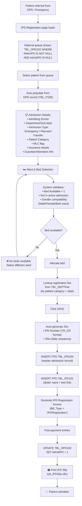

---

## 10. IPD Daily Clinical Care

**Actor:** Doctor / Nurse  
**Page:** [FormGridIPD.aspx](file:///F:/HIMS2.0/FormGridIPD.aspx) *(160KB — massive clinical page)*

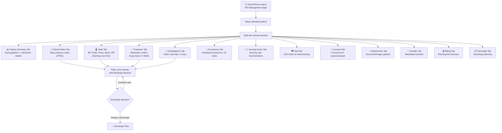

---

## 11. Discharge Flow

**Actor:** Doctor → Billing → Reception  
**Page:** [FormGridDischarge.aspx](file:///F:/HIMS2.0/FormGridDischarge.aspx)

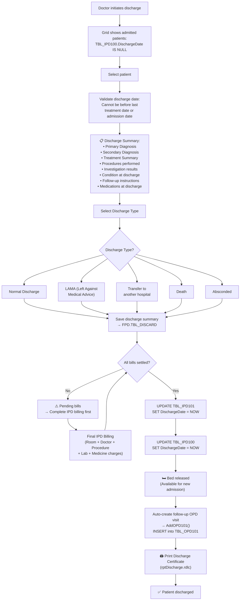

---

## 12. Emergency Flow

**Actor:** Emergency Doctor / Nurse  
**Page:** [Emergency.aspx](file:///F:/HIMS2.0/Emergency.aspx)

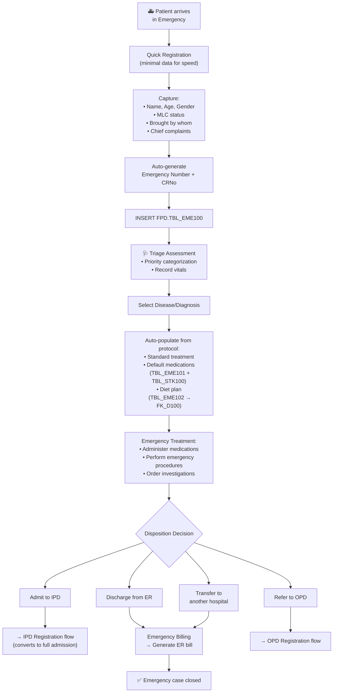

---

## 13. Lab Test Flow

**Actors:** Doctor → Billing → Phlebotomist → Lab Tech → Doctor  
**Pages:** [FormGridLabBill.aspx](file:///F:/HIMS2.0/FormGridLabBill.aspx) → [FormGridSampling.aspx](file:///F:/HIMS2.0/FormGridSampling.aspx)

```mermaid
flowchart TD
    A["🩺 Doctor orders lab tests<br/>during consultation"] --> B["Tests linked to patient<br/>in ECL.TBL_P100_TST"]

    B --> C["💰 Lab Billing Counter<br/>(FormGridLabBill.aspx)"]
    C --> D["Fetch unbilled tests:<br/>TBL_P100_TST JOIN TBL_INV_BM101<br/>WHERE ReferenceID IS NULL"]
    D --> E["Check pre-approved discounts<br/>from TBL_INV_BM100_APR<br/>(ApprovedType = 'Test')"]
    E --> F["Generate lab bill:<br/>• TBL_INV_BM100<br/>  (Bill_Type = 'OPDLabTest')<br/>• TBL_INV_BM101 (line items)"]
    F --> G["Auto-create result templates<br/>in FPD.TBL_TST_RD<br/>for every test parameter"]
    G --> H["🖨️ Print lab bill"]

    H --> I["🧪 Sample Collection<br/>(FormGridSampling.aspx)"]
    I --> J["View pending collections<br/>grouped by Sample Type"]
    J --> K["Generate Sample Barcode:<br/>SampleNo = MMDDYY + 4-digit seq"]
    K --> L["Record:<br/>• CollectionTime<br/>• Collector (FK_U100)<br/>• Sample type verified"]
    L --> M["Mark: Collected ✅"]

    M --> N["📦 Sample received in lab<br/>RecieveTime recorded<br/>(record locked from edit)"]
    N --> O["🔬 Lab Processing<br/>& Analysis"]
    O --> P["📊 Result Entry<br/>in FPD.TBL_TST_RD<br/>(parameter by parameter)"]
    P --> Q["Result Verification<br/>(senior lab tech)"]
    Q --> R["🖨️ Generate Lab Report<br/>(rptLab.rdlc)"]
    R --> S["🩺 Doctor reviews results"]
```

### Lab Sample Status Flow
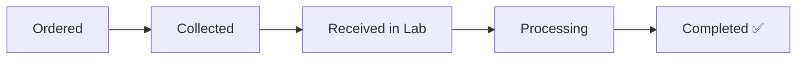

---

## 14. Procedure & OT Flow

**Actors:** Doctor → Billing → OT Staff  
**Pages:** [FormGridProcBilling.aspx](file:///F:/HIMS2.0/FormGridProcBilling.aspx) → [FormGridConsProc.aspx](file:///F:/HIMS2.0/FormGridConsProc.aspx) → [FormGridOTSch.aspx](file:///F:/HIMS2.0/FormGridOTSch.aspx)

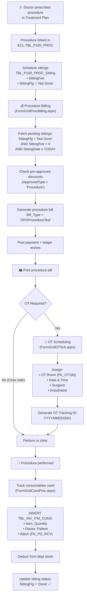

---

## 15. Dispensary / Pharmacy Flow

**Actor:** Pharmacist  
**Page:** [FormGridDispense.aspx](file:///F:/HIMS2.0/FormGridDispense.aspx) / [DispSale.aspx](file:///F:/HIMS2.0/DispSale.aspx)

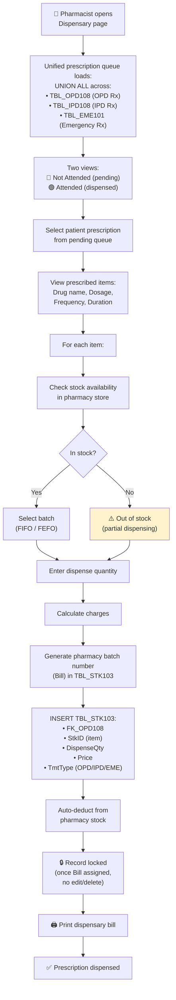

### OTC (Over-the-Counter) Sale Flow
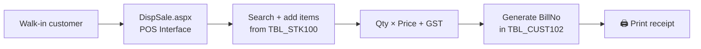

---

## 16. Billing Lifecycle

**Actor:** Billing Clerk → Approver  
**Pages:** [FormGridBillingApproval.aspx](file:///F:/HIMS2.0/FormGridBillingApproval.aspx), [FormGridBillCancel.aspx](file:///F:/HIMS2.0/FormGridBillCancel.aspx), [FormGridBillRefund.aspx](file:///F:/HIMS2.0/FormGridBillRefund.aspx)

```mermaid
flowchart TD
    A["Service rendered<br/>(OPD/IPD/Lab/Proc/Disp)"] --> B["Bill Created<br/>(TBL_INV_BM100 + BM101)"]

    B --> C{Discount requested?}
    C -->|Yes, above threshold| D["🔒 Pre-Billing Approval<br/>(FormGridBillingApproval.aspx)"]
    D --> E["Approver reviews<br/>discount amount"]
    E --> F{Approved?}
    F -->|Yes| G["Write to TBL_INV_BM100_APR<br/>(ApprovedAMT, DiscType='Discount')"]
    F -->|No| H["❌ Discount rejected"]
    G --> I["Bill finalized with discount"]
    C -->|No| I
    H --> I

    I --> J["💰 Payment collected"]
    J --> K["Bill complete ✅"]

    K --> L{Issue with bill?}
    L -->|Cancel| M["Bill Cancellation<br/>(FormGridBillCancel.aspx)"]
    L -->|Refund| N["Bill Refund<br/>(FormGridBillRefund.aspx)"]
    L -->|Duplicate needed| O["Duplicate Bill<br/>(FormGridDupBill.aspx)"]
    L -->|No issue| P["Done ✅"]

    M --> Q["Restriction: Same-day only<br/>+ Zero refund status"]
    Q --> R["Select items to cancel<br/>+ Mandatory reason"]
    R --> S["Archive to TBL_INV_BM100_Cancel"]
    S --> T["Reset procedure sittings<br/>(SittingFlg = 'Not Done')"]
    T --> U["Remove from BM101<br/>Decrement BM100, PMT_RCV,<br/>PAT_DEBIT, PAT_CREDIT"]
    U --> V{All items cancelled?}
    V -->|Yes| W["Purge entire bill<br/>from header tables"]
    V -->|No| X["Partial cancellation"]

    N --> Y["Select items to refund<br/>+ Mandatory reason"]
    Y --> Z["Write to TBL_INV_BM100_REF<br/>(ApprovedAMT, Remarks)"]
    Z --> AA["Refund processed ✅"]
```

---

## 17. Inventory & Procurement Flow

**Actors:** Department → Store Manager → Procurement → Vendor → Central Store → Departments  
**Pages:** Multiple (see labels below)

```mermaid
flowchart TD
    A["📦 Department identifies need"] --> B["Purchase Requisition<br/>(FormGridPRIndent.aspx)"]

    B --> C["Create PR:<br/>• Auto PR No: PR + YY + 7-digit<br/>• Add items + quantities<br/>• Set priority (Normal/Urgent)<br/>• Check current stock levels<br/>• Status: 'Initiate' → 'Raised'"]

    C --> D["PR Review<br/>(FormGridPRReview.aspx)"]
    D --> E["Reviewer actions:<br/>• View PR details<br/>• Upload vendor quotations<br/>• Compare quotation prices<br/>• Modify quantities"]
    E --> F{Decision?}
    F -->|Approve| G["Status → 'Approved'<br/>Mark approved quotations"]
    F -->|Reject| H["Status → 'Reject'"]
    F -->|Revise| I["Status → 'Initiate'<br/>Send back for changes"]

    G --> J["Purchase Order<br/>(FormGridDemandOrder.aspx)"]
    J --> K["Create PO from approved PR:<br/>• DO No: DO-yyyy100xxxxx<br/>• Select vendor per item<br/>• Enter negotiated rates<br/>• GST calculation<br/>  (CGST/SGST/IGST)<br/>• Delivery schedule<br/>• Terms & conditions<br/>• Status: 'Initiated'"]

    K --> L["PO Review<br/>(FormGridDemandReview.aspx)"]
    L --> M["Review against stock batches<br/>Calculate AvblQty<br/>using ConvRate"]
    M --> N{Decision?}
    N -->|Approve| O["Status → 'Approved'<br/>PO sent to vendor"]
    N -->|Reject/Hold| P["Status updated"]

    O --> Q["📦 Vendor dispatches goods"]
    Q --> R["GRN / Stock Entry<br/>(FormGridINV_STKEntry.aspx)"]
    R --> S["Receive against PO:<br/>• Received quantity<br/>  (partial allowed)<br/>• Batch No<br/>• Mfg Date, Expiry Date<br/>• Actual rates<br/>  (variance vs PO noted)<br/>• Invoice No & Date<br/>• Storage location<br/>• Quality check status"]
    S --> T["INSERT TBL_INV_PO_ITM_RCV<br/>Update PO quantities"]
    T --> U["📦 Stock in Central Store"]

    U --> V{"Distribution Method?"}
    V --> W["Demand Issue<br/>(FormGridDemandIssue.aspx)"]
    V --> X["Bulk Issue<br/>(FormGridBulkIssue.aspx)"]

    W --> Y["Issue against approved demand:<br/>• Select batch<br/>• Enter issued qty<br/>• Partial OK<br/>• Non-consumable → auto-create<br/>  Asset records (ASTNO format)<br/>• Log in TBL_INV_DO_ITM_ISS_HIS"]

    X --> Z["Bulk allocate to doctors:<br/>• Select doctor (FK_U100_DOC)<br/>• Validate against dept stock<br/>• Log in TBL_BulkIssue_HIS"]

    Y --> AA["📦 Department Stock"]
    Z --> AA
    AA --> AB["Consumption during<br/>procedures/treatment<br/>→ TBL_INV_ITM_CONS"]
    AA --> AC{Issue?}
    AC -->|Return| AD["Return to store"]
    AC -->|Expired/Damaged| AE["Disposal/Discard"]
```

---

## 18. Employee Onboarding

**Actor:** HR Manager  
**Page:** [FormGridJobProfile.aspx](file:///F:/HIMS2.0/FormGridJobProfile.aspx) → [FormGridEmpConfig.aspx](file:///F:/HIMS2.0/FormGridEmpConfig.aspx)

```mermaid
flowchart TD
    A["👤 New employee joins"] --> B["HR opens Job Profile page"]
    B --> C["📋 Personal Details:<br/>• Name, Father's Name<br/>• DOB, Gender, Blood Group<br/>• Marital Status<br/>• Photo upload"]
    C --> D["📍 Contact Details:<br/>• Present Address<br/>• Permanent Address<br/>• Phone, Email<br/>• Emergency Contact"]
    D --> E["💼 Employment Details:<br/>• Auto-generate EMP Code<br/>  (EMP + 5-digit: EMP00001)<br/>• Joining Date<br/>• Department<br/>• Designation<br/>• Type: Permanent/Contract/Trainee<br/>• Reporting Manager<br/>• Biometric Thumb ID"]
    E --> F["🎓 Qualifications:<br/>• Education<br/>• Specialization<br/>• Experience"]
    F --> G["🏦 Bank Details:<br/>• Account No, Bank Name<br/>• IFSC Code"]
    G --> H["📄 Statutory:<br/>• PAN, Aadhar<br/>• PF Number, ESI Number<br/>• UAN"]
    H --> I["💰 Salary:<br/>• Compensation Plan (FK_COMP100)<br/>• Basic Pay + Allowances"]
    I --> J["📎 Upload Documents"]
    J --> K["INSERT ECL.TBL_EMP100"]

    K --> L["HR Configuration<br/>(FormGridEmpConfig.aspx)"]
    L --> M["Assign to Department(s)<br/>→ TBL_EMP_DEPT"]
    M --> N["Assign System Roles<br/>→ TBL_EMP_DEPT_ROLE"]
    N --> O["Auto-sync permissions<br/>→ FPD.TBL_U101"]
    O --> P["Create User Account<br/>(FormGridUser.aspx)<br/>Link FK_U100"]
    P --> Q["✅ Employee onboarded"]
```

---

## 19. Attendance & Leave Flow

**Actors:** Employee → Manager → HR  
**Pages:** [FormGridSTFATT.aspx](file:///F:/HIMS2.0/FormGridSTFATT.aspx), [FormGridLeave.aspx](file:///F:/HIMS2.0/FormGridLeave.aspx), [FormGridLeaveApprove.aspx](file:///F:/HIMS2.0/FormGridLeaveApprove.aspx)

```mermaid
flowchart TD
    A["📅 Daily Attendance<br/>(FormGridSTFATT.aspx)"] --> B["Auto-initialize rows<br/>for all active employees"]
    B --> C["Sync biometric data<br/>from vw_EMP_ATT:<br/>• BioCheckInTime<br/>• BioCheckOutTime"]
    C --> D{Biometric punch exists?}
    D -->|Yes| E["Status = Present (P)"]
    D -->|No| F["Status = Absent (A)"]
    E --> G["Track:<br/>Late marking<br/>Early leaving"]
    F --> H["HR can override<br/>(UpdateFlag = 'UserUpdated')"]

    G --> I["✅ Attendance recorded"]
    H --> I

    J["📋 LEAVE APPLICATION"] --> K["Employee opens<br/>Leave Apply page"]
    K --> L["Select Leave Type:<br/>CL / EL / SL / ML / etc."]
    L --> M["Enter From/To dates<br/>+ half-day option"]
    M --> N["Enter reason + contact details"]
    N --> O["System checks leave balance<br/>(configured in TBL_Leave100<br/>via TBL_LeavePolicy +<br/>TBL_ServiceRule)"]
    O --> P{Balance sufficient?}
    P -->|No| Q["⚠️ Insufficient balance"]
    P -->|Yes| R["Submit application<br/>→ INSERT TBL_Leave101<br/>Status = 'Pending'"]

    R --> S["👔 MANAGER APPROVAL<br/>(FormGridLeaveApprove.aspx)"]
    S --> T["Manager views pending<br/>leave applications"]
    T --> U["View employee details<br/>+ leave history<br/>+ dept staff availability"]
    U --> V{Decision?}
    V -->|Approve| W["Status → 'Approved'<br/>Leave balance updated"]
    V -->|Reject| X["Status → 'Rejected'<br/>+ Mandatory RejectReason"]

    W --> Y["Employee notified ✅"]
    X --> Y

    Z["⏱️ REGULARIZATION"] --> AA["Employee submits regularization<br/>for missed punch / absence"]
    AA --> AB["Provide NewInTime, NewOutTime<br/>+ justification"]
    AB --> AC["Manager approves"]
    AC --> AD["TBL_EMP100_Att updated:<br/>Attendance = 'P'<br/>REG_Approved flag set ✅"]
```

---

## 20. Payroll Flow

**Actor:** HR / Accounts  
**Page:** [FormGridPayroll.aspx](file:///F:/HIMS2.0/FormGridPayroll.aspx)

```mermaid
flowchart TD
    A["💰 HR opens Payroll page"] --> B["Select Month & Year"]
    B --> C["Step 1: Working Days Calculation<br/>TBL_EMP_WrkDay evaluates:<br/>• Calendar period (TBL_Period)<br/>• Holiday master (TBL_Holiday)<br/>→ Expected working days"]

    C --> D["Step 2: Attendance Sync<br/>Aggregate daily biometric/manual<br/>attendance for the month"]

    D --> E["Step 3: Leave Processing<br/>Execute sp_CALLV<br/>→ Approved paid leaves<br/>→ LOP (Loss of Pay) days"]

    E --> F["Step 4: Salary Calculation"]
    F --> G["Fetch Gross Salary<br/>from TBL_COMP101_VAL"]
    G --> H["Calculate Daily Rate:<br/>Daily Rate = Gross / 30"]
    H --> I["Calculate LOP Deduction:<br/>LOP = (Gross × LOP Days) / 30"]
    I --> J["INSERT LOP deduction<br/>→ TBL_EMP_DED"]

    J --> K["Compute Net Pay:<br/>━━━━━━━━━━━━━━━━━<br/>EARNINGS:<br/>+ Basic Pay<br/>+ DA (Dearness Allowance)<br/>+ HRA (House Rent)<br/>+ Conveyance<br/>+ Medical<br/>+ Special Allowance<br/>━━━━━━━━━━━━━━━━━<br/>DEDUCTIONS:<br/>- PF (Provident Fund)<br/>- ESI (Employee State Insurance)<br/>- TDS (Tax Deducted at Source)<br/>- Professional Tax<br/>- Loan Recovery<br/>- LOP Deduction<br/>━━━━━━━━━━━━━━━━━<br/>= NET PAY"]

    K --> L["Write to TBL_EMP_Payroll:<br/>• Working days<br/>• Leave days<br/>• LOP days<br/>• Gross salary<br/>• Net payable"]

    L --> M["Review & Finalize"]
    M --> N["🖨️ Generate Salary Slips<br/>(RPTEMPSAL.rdlc)"]
    N --> O["Generate Bank Statement<br/>for salary disbursement"]
    O --> P["✅ Payroll processed"]
```

---

## 21. Camp Management Flow

**Actor:** Admin / Doctor  
**Page:** [FormGridCamp.aspx](file:///F:/HIMS2.0/FormGridCamp.aspx)

```mermaid
flowchart TD
    A["🏕️ Plan dental health camp"] --> B["Create camp record<br/>→ ECL.TBL_CMP100"]
    B --> C["Camp Details:<br/>• Organization Name<br/>• Contact Person<br/>• Location<br/>• Date<br/>• Doctor In-Charge"]
    C --> D["Assign camp doctors<br/>→ ECL.TBL_CMP101"]
    D --> E["🏕️ CAMP DAY"]
    E --> F["Register camp patients<br/>→ ECL.TBL_CMP102"]
    F --> G["Record observations<br/>& findings per patient"]
    G --> H["Track expenses"]
    H --> I{Patient needs hospital visit?}
    I -->|Yes| J["Link to OPD Registration<br/>(Camp Reference flow)"]
    I -->|No| K["Camp record complete"]
    J --> L["Patient visits hospital<br/>→ auto-fill from camp data"]
    K --> M["Camp completion date set"]
    M --> N["🖨️ Generate Camp Report<br/>(rpt_CAMP_REGISTER.rdlc)"]
```

---

## 22. Counseling & Enquiry Flow

**Actor:** Counselor / Receptionist  
**Page:** [CouncelEnq.aspx](file:///F:/HIMS2.0/CouncelEnq.aspx)

```mermaid
flowchart TD
    A["📞 Enquiry received<br/>(Walk-in / Phone / Online)"] --> B["Check existing by<br/>Country Code + Mobile"]
    B --> C{Existing enquiry?}
    C -->|Yes| D["Update existing record"]
    C -->|No| E["Create new enquiry<br/>→ ECL.TBL_Enq_Councel<br/>(Source = 'WEB')"]

    D --> F["Capture details:<br/>• Name, Email, Phone<br/>• Country, State, City<br/>• Department interested in<br/>• Treatment interested in<br/>• Source of enquiry"]
    E --> F

    F --> G["Counseling session"]
    G --> H["Discuss:<br/>• Treatment options<br/>• Cost estimates<br/>• Expected outcomes<br/>• Duration"]
    H --> I{Patient decision?}
    I --> J["✅ Converted<br/>→ Proceed to Registration"]
    I --> K["📅 Follow-up scheduled"]
    I --> L["❌ Lost / Not interested"]

    J --> M["→ OPD Registration flow"]
    K --> N["Follow-up date set<br/>Status: Follow-up"]
```

### Enquiry Status Flow
```mermaid
flowchart LR
    A["New"] --> B["Counseled"]
    B --> C["Converted ✅"]
    B --> D["Follow-up 📅"]
    B --> E["Lost ❌"]
    D --> B
```

---

## 23. MIS & Reports Flow

**Actor:** Admin / Management / HOD  
**Pages:** [MIS.aspx](file:///F:/HIMS2.0/MIS.aspx) → [ReportRegister.aspx](file:///F:/HIMS2.0/ReportRegister.aspx) → [ReportViewer.aspx](file:///F:/HIMS2.0/ReportViewer.aspx)

```mermaid
flowchart TD
    A["📊 User opens MIS / Reports"] --> B{Which interface?}

    B --> C["MIS Reports<br/>(MIS.aspx)"]
    B --> D["Report Register<br/>(ReportRegister.aspx)"]
    B --> E["Dashboard<br/>(DashboardViewer.aspx)"]

    C --> F["Select report from dropdown<br/>(50+ report types)"]
    F --> G["Set filters:<br/>• Date Range (From/To)<br/>• Department<br/>• Doctor<br/>• Center/Unit<br/>• Patient Category"]
    G --> H["Click SHOW"]
    H --> I["Execute stored procedure<br/>with filter parameters"]
    I --> J["Store DataSet in Session"]
    J --> K["Redirect → ReportViewer.aspx"]
    K --> L["Load RDLC template<br/>+ bind DataSet"]
    L --> M["🖨️ Render report<br/>(view / print / export)"]

    D --> N["Select report category<br/>from dropdown"]
    N --> O["Dynamic filter panels<br/>shown/hidden per report type"]
    O --> G

    E --> P["DevExpress Dashboard Viewer<br/>loads XML dashboard definition"]
    P --> Q["📊 Interactive KPIs:<br/>• Patient counts<br/>• Category breakdown<br/>• Financial collections<br/>• Department analytics"]
```

---

## 24. End-to-End Patient Journey

> This is the **complete flow** a patient experiences from first contact to treatment completion.

```mermaid
flowchart TD
    START["🏥 PATIENT JOURNEY BEGINS"] --> A

    A["📞 Step 1: ENQUIRY<br/>(Optional)"]
    A --> A1["Enquiry via<br/>Walk-in / Phone / Online"]
    A1 --> A2["Counseling session<br/>Treatment options discussed"]
    A2 --> A3["Cost estimate shared"]
    A3 --> B

    B["📅 Step 2: APPOINTMENT<br/>(Optional)"]
    B --> B1["Book appointment<br/>Select doctor + slot"]
    B1 --> B2["Get token number"]
    B2 --> B3["SMS confirmation received"]
    B3 --> C

    C["📝 Step 3: REGISTRATION"]
    C --> C1{New or Returning?}
    C1 -->|New| C2["Full registration<br/>Demographics + UHID generated"]
    C1 -->|Returning| C3["Revisit registration<br/>Same UHID, new visit"]
    C2 --> C4["OPD Slip printed"]
    C3 --> C4

    C4 --> D["🔔 Step 4: CHECK-IN"]
    D --> D1["Check-in at reception<br/>Assigned to Doctor + PG"]
    D1 --> D2["Token called<br/>Enter consultation room"]

    D2 --> E["🩺 Step 5: CONSULTATION"]
    E --> E1["Case Sheet documented:<br/>• Complaints<br/>• History<br/>• Vitals<br/>• Oral Exam"]
    E1 --> E2["🦷 Dental Chart:<br/>Tooth-by-tooth examination"]
    E2 --> E3["Diagnosis made"]

    E3 --> F["📋 Step 6: TREATMENT PLAN"]
    F --> F1["Interactive tooth chart<br/>Treatment per tooth"]
    F1 --> F2["Procedure selection<br/>(Filling/RCT/Crown/etc.)"]
    F2 --> F3["Cost estimation"]
    F3 --> F4["Patient consent"]

    F4 --> G{What's needed?}

    G -->|Lab Tests| H["🔬 Step 7a: LAB"]
    H --> H1["Lab billing"]
    H1 --> H2["Sample collection"]
    H2 --> H3["Processing"]
    H3 --> H4["Results to doctor"]

    G -->|Procedures| I["🦷 Step 7b: PROCEDURE"]
    I --> I1["Procedure billing"]
    I1 --> I2["OT scheduled (if needed)"]
    I2 --> I3["Procedure performed"]
    I3 --> I4["Consumables tracked"]

    G -->|Medicines| J["💊 Step 7c: PHARMACY"]
    J --> J1["Prescription dispensing"]
    J1 --> J2["Medicines handed over"]

    G -->|Admission needed| K["🛏️ Step 7d: ADMIT TO IPD"]
    K --> K1["IPD registration + bed"]
    K1 --> K2["Daily care cycle"]
    K2 --> K3["Discharge when ready"]

    H4 --> L["💰 Step 8: BILLING"]
    I4 --> L
    J2 --> L
    K3 --> L

    L --> L1["All services consolidated"]
    L1 --> L2["Discounts applied"]
    L2 --> L3["GST calculated"]
    L3 --> L4["Payment collected"]
    L4 --> L5["Bill printed"]

    L5 --> M["📅 Step 9: FOLLOW-UP"]
    M --> M1["Next appointment scheduled"]
    M1 --> M2["Follow-up instructions given"]
    M2 --> M3["Treatment status updated"]

    M3 --> N{More sittings needed?}
    N -->|Yes| D1
    N -->|No| O["✅ TREATMENT COMPLETE"]

    style START fill:#4CAF50,color:#fff
    style O fill:#4CAF50,color:#fff
```

---

## 📌 Quick Reference: User → Flow Mapping

| User Role | Primary Flows |
|---|---|
| **Receptionist** | Registration → Appointment → Check-in → OPD Billing |
| **Doctor (Senior)** | OPD Queue → Case Sheet → Treatment Plan → Approve PG work |
| **Doctor (PG/Junior)** | OPD Queue → Case Sheet → Treatment Plan → Submit for review |
| **Billing Clerk** | OPD/IPD/Lab/Proc Billing → Cancel → Refund |
| **Lab Technician** | Sample Collection → Processing → Result Entry |
| **Pharmacist** | Prescription Dispensing → OTC Sales |
| **Nurse** | IPD Care → Vitals → Nursing Notes → Diet |
| **Store Manager** | PR Review → PO → GRN → Issue → Stock tracking |
| **HR Manager** | Onboarding → Attendance → Leave Approval → Payroll |
| **Admin** | User/Role Management → Config → DB Backup → Reports |
| **Counselor** | Enquiry → Counseling → Conversion tracking |
| **HOD** | Department reports → Approvals → Doctor assignment |

---

## 📌 Quick Reference: Page → Flow Mapping

| Page | Flow(s) |
|---|---|
| [Login.aspx](file:///F:/HIMS2.0/Login.aspx) | Authentication |
| [FormGridOPDRec.aspx](file:///F:/HIMS2.0/FormGridOPDRec.aspx) | New Patient Registration |
| [FormGridOPDReZ.aspx](file:///F:/HIMS2.0/FormGridOPDReZ.aspx) | Revisit Registration |
| [FormGridAppointmentREC.aspx](file:///F:/HIMS2.0/FormGridAppointmentREC.aspx) | Appointment + Check-in |
| [FormGridOPD.aspx](file:///F:/HIMS2.0/FormGridOPD.aspx) | Doctor's OPD Queue |
| [FormGridCaseSheet.aspx](file:///F:/HIMS2.0/FormGridCaseSheet.aspx) | Clinical Documentation |
| [FormGridPGTreatment.aspx](file:///F:/HIMS2.0/FormGridPGTreatment.aspx) | Dental Treatment Planning |
| [FormGridOPDBill.aspx](file:///F:/HIMS2.0/FormGridOPDBill.aspx) | OPD Billing |
| [FormGridIPDReg.aspx](file:///F:/HIMS2.0/FormGridIPDReg.aspx) | IPD Admission |
| [FormGridIPD.aspx](file:///F:/HIMS2.0/FormGridIPD.aspx) | IPD Daily Care |
| [FormGridDischarge.aspx](file:///F:/HIMS2.0/FormGridDischarge.aspx) | Discharge |
| [Emergency.aspx](file:///F:/HIMS2.0/Emergency.aspx) | Emergency |
| [FormGridLabBill.aspx](file:///F:/HIMS2.0/FormGridLabBill.aspx) | Lab Billing |
| [FormGridSampling.aspx](file:///F:/HIMS2.0/FormGridSampling.aspx) | Sample Collection |
| [FormGridProcBilling.aspx](file:///F:/HIMS2.0/FormGridProcBilling.aspx) | Procedure Billing |
| [FormGridOTSch.aspx](file:///F:/HIMS2.0/FormGridOTSch.aspx) | OT Scheduling |
| [FormGridDispense.aspx](file:///F:/HIMS2.0/FormGridDispense.aspx) | Dispensary |
| [DispSale.aspx](file:///F:/HIMS2.0/DispSale.aspx) | OTC Pharmacy Sales |
| [FormGridBillCancel.aspx](file:///F:/HIMS2.0/FormGridBillCancel.aspx) | Bill Cancellation |
| [FormGridBillRefund.aspx](file:///F:/HIMS2.0/FormGridBillRefund.aspx) | Bill Refund |
| [FormGridBillingApproval.aspx](file:///F:/HIMS2.0/FormGridBillingApproval.aspx) | Billing/Discount Approval |
| [FormGridPRIndent.aspx](file:///F:/HIMS2.0/FormGridPRIndent.aspx) | Purchase Requisition |
| [FormGridDemandOrder.aspx](file:///F:/HIMS2.0/FormGridDemandOrder.aspx) | Purchase Order |
| [FormGridINV_STKEntry.aspx](file:///F:/HIMS2.0/FormGridINV_STKEntry.aspx) | GRN / Stock Entry |
| [FormGridJobProfile.aspx](file:///F:/HIMS2.0/FormGridJobProfile.aspx) | Employee Profile |
| [FormGridSTFATT.aspx](file:///F:/HIMS2.0/FormGridSTFATT.aspx) | Staff Attendance |
| [FormGridLeave.aspx](file:///F:/HIMS2.0/FormGridLeave.aspx) | Leave Application |
| [FormGridLeaveApprove.aspx](file:///F:/HIMS2.0/FormGridLeaveApprove.aspx) | Leave Approval |
| [FormGridPayroll.aspx](file:///F:/HIMS2.0/FormGridPayroll.aspx) | Payroll |
| [MIS.aspx](file:///F:/HIMS2.0/MIS.aspx) | MIS Reports |
| [FormGridCamp.aspx](file:///F:/HIMS2.0/FormGridCamp.aspx) | Camp Management |
| [CouncelEnq.aspx](file:///F:/HIMS2.0/CouncelEnq.aspx) | Counseling & Enquiry |

---
---

# 🗄️ DATABASE TABLE REFERENCE
## Every Table, What It Stores, and Which Flow Uses It

> The system uses **3 database schemas**: `FPD` (core clinical/hospital), `ECL` (extended/configurable modules), and `EDS` (delegation/executive).

---

## 📂 Schema: FPD (Core Hospital Tables)

### Patient & Registration Tables

| Table | Purpose | Used In Flow(s) |
|---|---|---|
| `FPD.TBL_P100` | **Patient Master** — Demographics, UHID, Name, DOB, Age, Gender, Address, Phone, Aadhar, Photo, Religion, Occupation, Marital Status, Patient Category | Registration (New + Revisit), Appointment, OPD, IPD, Billing, Case Sheet, Treatment, Emergency, Camp, Patient Update |
| `FPD.TBL_OPD100` | **OPD Visit Master** — Visit header linking patient to date and department | OPD Consultation |
| `FPD.TBL_OPD101` | **OPD Visit Detail** — Visit line items, Fee, Bill Number, Daily Serial No (SNo), Department | OPD Consultation, OPD Billing, Discharge (auto follow-up) |
| `FPD.TBL_OPD102` | **OPD Treatment Record** — Treatment entries per visit, ReferIPD flag, AdmitIPD flag, NextVisitDate | OPD Consultation, Treatment Planning, IPD Referral, IPD Admission |
| `FPD.TBL_OPD108` | **OPD Prescription** — Prescribed medicines from OPD (Drug ID, Qty, Unit) | Treatment Planning, Dispensary |

### Dental & Case Sheet Tables

| Table | Purpose | Used In Flow(s) |
|---|---|---|
| `FPD.TBL_CS101_Case` | **Case Sheet — History/Notes** — Complaint details, history items, sub-names, descriptions | Case Sheet Documentation |
| `FPD.TBL_CS101_GPExam` | **Case Sheet — General Physical Exam** — Vitals, physical build, anemia, jaundice, edema, lymphadenopathy | Case Sheet Documentation |
| `FPD.TBL_CS101_SysExam` | **Case Sheet — Systemic Examination** — CVS, RS, CNS, Abdomen findings | Case Sheet Documentation |
| `FPD.TBL_CS101_DAS` | **Case Sheet — Disease Activity Scale** — DAS clinical scoring | Case Sheet Documentation |
| `FPD.TBL_CS101_ASHT` | **Case Sheet — ASHT Scale** — ASHT scoring parameters | Case Sheet Documentation |
| `FPD.TBL_CS101_SAM` | **Case Sheet — SAM Scale** — SAM scoring parameters | Case Sheet Documentation |
| `FPD.TBL_CS101_Diag` | **Case Sheet — Diagnosis** — Differential & final diagnosis details | Case Sheet Documentation |

### IPD (Inpatient) Tables

| Table | Purpose | Used In Flow(s) |
|---|---|---|
| `FPD.TBL_IPD100` | **IPD Admission Master** — Patient FK, Admit Date, Discharge Date, CRNo, YR_CR, OPD reference | IPD Admission, IPD Care, Discharge |
| `FPD.TBL_IPD101` | **IPD Admission Detail** — Ward FK, Bed FK, Discharge Date (bed release trigger) | IPD Admission, Ward/Bed Mgmt, Discharge |
| `FPD.TBL_IPD102` | **IPD Clinical Record** — Treatment details, diet plan FK | IPD Daily Care, Diet Management |
| `FPD.TBL_IPD102_PR` | **IPD Progress Notes** — Doctor Notes (Rich HTML), Treatment Advised, Fluid balance (Oral/IV/RT/Urine/Drain) | IPD Daily Care, Case Sheet |
| `FPD.TBL_IPD102_NS` | **IPD Nursing Vitals Log** — Time, Temp, Pulse, Resp, BP Systolic, BP Diastolic, Medicines, Timing | IPD Daily Care, Case Sheet |
| `FPD.TBL_IPD107` | **IPD Diet Assignment** — Diet plan FK (links to TBL_D100) | IPD Daily Care, Diet Management |
| `FPD.TBL_IPD108` | **IPD Prescription** — Prescribed medicines (Drug ID from TBL_STK100, Qty, Unit) | IPD Daily Care, Dispensary |
| `FPD.TBL_DISCARD` | **Discharge Summary** — Result, Advice, Discharge outcome | Discharge |

### Ward & Bed Tables

| Table | Purpose | Used In Flow(s) |
|---|---|---|
| `FPD.TBL_WD100` | **Ward Master** — Ward No, Floor, Gender policy (Male/Female/Both), Ward Type, Fee, Contact Person | Ward/Bed Management, IPD Admission |
| `FPD.TBL_WD101` | **Ward-Department Mapping** — Links wards to departments | Ward/Bed Management |
| `FPD.TBL_WD102` | **Ward Admission Days** — Allowed admission days per ward | Ward/Bed Management |
| `FPD.TBL_BD100` | **Bed Master** — Bed Number, Ward FK, Available flag (1/0) | Ward/Bed Management, IPD Admission, Discharge |

### Lab & Diagnostics Tables

| Table | Purpose | Used In Flow(s) |
|---|---|---|
| `FPD.TBL_TST100` | **Lab Test Master** — Test Name, Code, Category, Sample type, Method, TAT | Lab Master Setup |
| `FPD.TBL_TST101` | **Lab Test Parameters** — Sub-tests/parameters per test, Normal ranges | Lab Master Setup, Result Entry |
| `FPD.TBL_TST102` | **Lab Test Default Consumables** — Default consumables per test | Lab Master Setup |
| `FPD.TBL_TST_RD` | **Lab Test Results** — Actual result values per parameter per patient | Lab Result Entry |
| `FPD.TBL_TST_SAMPLE` | **Lab Sample Tracking** — Sample ID, barcode, status | Sample Collection |

### Procedure & Treatment Tables

| Table | Purpose | Used In Flow(s) |
|---|---|---|
| `FPD.TBL_K100` | **Procedure/Karma Master** — Procedure Name, Code, Category, OPD/IPD flags, SittingCNT | Procedure Management, Treatment Planning, Service Config |
| `FPD.TBL_K102` | **Procedure-Department Mapping** — Links procedures to sub-departments | Procedure Management, OT Scheduling |

### Emergency Tables

| Table | Purpose | Used In Flow(s) |
|---|---|---|
| `FPD.TBL_EME100` | **Emergency Master** — CRNo, Demographics, Disease, Treatment, Remarks | Emergency Registration |
| `FPD.TBL_EME101` | **Emergency Medications** — Prescribed items (linked to TBL_STK100) | Emergency Treatment, Dispensary |
| `FPD.TBL_EME102` | **Emergency Diet** — Diet plan links (FK_D100) | Emergency Treatment, Diet |

### Diet Tables

| Table | Purpose | Used In Flow(s) |
|---|---|---|
| `FPD.TBL_D100` | **Diet Plan Master** — Diet plan names (Normal/Soft/Liquid/Diabetic, etc.) | Diet Management |
| `FPD.TBL_D101` | **Diet Plan Details** — Ingredients and measurements per plan | Diet Management |

### Pharmacy & Stock Tables

| Table | Purpose | Used In Flow(s) |
|---|---|---|
| `FPD.TBL_STK100` | **Pharmacy Item Stock** — Medicine/item master for pharmacy | Dispensary, Emergency, Prescription, OTC Sales |
| `FPD.TBL_STK103` | **Dispensing Record** — DispenseQty, Price, Bill batch no, TmtType (OPD/IPD/EME) | Dispensary |

### Dispensary Sales Tables

| Table | Purpose | Used In Flow(s) |
|---|---|---|
| `FPD.TBL_CUST100` | **Pharmacy Customer Master** — Walk-in customer details | OTC Pharmacy Sales |
| `FPD.TBL_CUST101` | **Pharmacy Sale Invoice Header** — BillNo, Date | OTC Pharmacy Sales |
| `FPD.TBL_CUST102` | **Pharmacy Sale Line Items** — Item, Qty, Unit Price, Total | OTC Pharmacy Sales |

### Department & Configuration Tables

| Table | Purpose | Used In Flow(s) |
|---|---|---|
| `FPD.TBL_DEPT100` | **Department Master** — Dept Name, Code, Type, Fee | Department Config, OPD Billing, Registration |
| `FPD.TBL_DEPT_TIME` | **Department Shift Timings** — OPDDay, ShiftName, StartTime, EndTime | Shift Management, Doctor Assignment |
| `FPD.TBL_DEPT_EQP` | **Department Equipment** — Equipment inventory per department | Department Config |
| `FPD.TBL_Menu` | **Navigation Menu Master** — MainMenuName, SubMenuName, Page URL, MenuOrder, IconType, Visible flag | Authentication, Role-based Navigation |

### User & Security Tables

| Table | Purpose | Used In Flow(s) |
|---|---|---|
| `FPD.TBL_U100` | **User Master** — LoginID, Password (AES encrypted), Name, Status | Login, Lock, Change Password, User Management |
| `FPD.TBL_U101` | **User-Role Mapping** — FK_U100 ↔ FK_U200 | Login (menu load), Role Management, Employee Config |
| `FPD.TBL_U102` | **User-Department Mapping** — Doctor/user assigned to departments, Dept_status | Doctor Assignment |
| `FPD.TBL_U103` | **User Duty Roster** — User FK, Dept FK, Day (Mon–Sun) | Roster/Schedule, Doctor Assignment |
| `FPD.TBL_U200` | **Role Master** — Role Name, RoleType, ADD_FK_U100 (system-defined flag) | Role Management |
| `FPD.TBL_U201` | **Role-Menu Permissions** — FK_U200 ↔ FK_Menu | Role Management, Navigation |

### HR & Payroll Tables (FPD schema)

| Table | Purpose | Used In Flow(s) |
|---|---|---|
| `FPD.TBL_EMP_Payroll` | **Monthly Payroll Summary** — Working days, Leave days, LOP days, Gross, Net | Payroll |
| `FPD.TBL_EMP_WrkDay` | **Working Days Calculation** — Expected working days per employee per period | Payroll |
| `FPD.TBL_EMP_DED` | **Payroll Deductions** — LOP deductions, other deductions | Payroll |
| `FPD.TBL_Period` | **Calendar Period Master** — Financial periods/months | Payroll |
| `FPD.TBL_Holiday` | **Holiday Master** — Hospital holidays | Payroll, Calendar |

### Inventory Tables (FPD schema)

| Table | Purpose | Used In Flow(s) |
|---|---|---|
| `FPD.TBL_INV_PO_ITM_RCV` | **GRN — Goods Received** — Received qty, purchase/sale amount, location, expiry, batch | GRN / Stock Entry |
| `FPD.TBL_INV_DO_ITM_ISS` | **Sub-dept Issue Records** — Direct sub-department stock issues | Stock Entry, Demand Issue |
| `FPD.TBL_INV_PO_ITM` | **PO Item Quantities** — Purchase order item tracking | GRN / Stock Entry |
| `FPD.TBL_INV_DO_ITM` | **Demand Order Items** — Items in demand orders | Demand Issue |

### Report & Backup Tables

| Table | Purpose | Used In Flow(s) |
|---|---|---|
| `FPD.TBL_BKPSTAT` | **Backup Audit Log** — DBName, FileName, BkpTime, User | DB Backup |

---

## 📂 Schema: ECL (Extended / Configurable Modules)

### Appointment & Scheduling Tables

| Table | Purpose | Used In Flow(s) |
|---|---|---|
| `ECL.TBL_Appointment` | **Appointment Master** — Patient FK, DOC_U100 (Senior), PG_U100 (Junior), Intern, AppointmentDate, CheckIn flag, RPT_FLG, CancelDate | Appointment Booking, Check-in, OPD Queue, Treatment Planning, Change Doctor |

### Billing & Finance Tables

| Table | Purpose | Used In Flow(s) |
|---|---|---|
| `ECL.TBL_INV_BM100` | **Bill Header** — Bill No, Bill_Type (Registration/OPDLabTest/OPDProcedureTest/IPDRegistration, etc.), BillDate, NetAmount | ALL Billing flows (OPD, IPD, Lab, Procedure, Dispensary, Registration) |
| `ECL.TBL_INV_BM101` | **Bill Line Items** — Service/item details, Rate, Qty, Amount, AccessType, ReferenceID | ALL Billing flows |
| `ECL.TBL_PMT_RCV` | **Payment Receipt** — Payment amount, mode, reference | ALL Billing flows |
| `ECL.TBL_PAT_DEBIT` | **Patient Debit Ledger** — Debit entries (double-entry accounting) | ALL Billing flows, Bill Cancel |
| `ECL.TBL_PAT_CREDIT` | **Patient Credit Ledger** — Credit entries (double-entry accounting) | ALL Billing flows, Bill Cancel |
| `ECL.TBL_INV_BM100_APR` | **Billing Pre-Approval** — Approved discounts (ApprovedAMT, ApprovedType: 'Test'/'Procedure'/'Discount'), Usedflg | Billing Approval, Lab Billing, Procedure Billing |
| `ECL.TBL_INV_BM100_Cancel` | **Cancelled Bill Archive** — Cancelled line items audit trail | Bill Cancellation |
| `ECL.TBL_INV_BM100_REF` | **Refund Records** — ApprovedAMT, Remarks, ApprovedDate | Bill Refund |
| `ECL.TBL_INV_CUST100` | **Patient as Customer** — Customer record for financial tracking | Registration, Patient Update, Billing |

### Procedure & Treatment Tables

| Table | Purpose | Used In Flow(s) |
|---|---|---|
| `ECL.TBL_P100_PROC` | **Patient Procedure Assignments** — Procedures prescribed to patients | Procedure Billing, Treatment Planning |
| `ECL.TBL_P100_PROC_Sitting` | **Procedure Sittings** — SittingFee, SittingFlg ('Not Done'/'Done'), SittingDate | Procedure Billing, Bill Cancel (reset sittings) |
| `ECL.TBL_P100_TST` | **Patient Test Requests** — Tests ordered for patient | Lab Billing |
| `ECL.TBL_OT_SCH` | **OT Schedule** — OT Room FK, Surgeon, Start/End Time, OTID (YYYYMMDD0001) | OT Scheduling |

### Lab Tables

| Table | Purpose | Used In Flow(s) |
|---|---|---|
| `ECL.TBL_TST_DEPT` | **Test-Department Mapping** — Links tests to departments | Lab Master Setup |
| `ECL.TBL_TST_FEE` | **Test Fee Configuration** — Category-wise fee per test | Lab Master Setup, Lab Billing |

### Inventory & Supply Chain Tables

| Table | Purpose | Used In Flow(s) |
|---|---|---|
| `ECL.TBL_INV_ITM100` | **Item/Product Master** — Item Code, Name, Type, Category, UOM (Purchase + Sales), ConvRate, HSN, Consumable flag, BulkIssue flag. ITMflg='I' for Items, 'P' for Products | Item Master, Product Master |
| `ECL.TBL_INV_VEN100` | **Vendor Master** — Name, Contact, GST, PAN, Bank details, Terms, Category | Vendor Management |
| `ECL.TBL_INV_DPT100` | **Inventory Department Master** — Departments for inventory (Central Store = ID 1) | Department Inventory, Stock Tracking |
| `ECL.TBL_INV_DPT_DSUB` | **Inventory Sub-Department** — Sub-departments/units under main dept, Dept Type | Department Inventory, IPD Reg, All dept-level operations |
| `ECL.TBL_INV_SUBDPT_U200` | **Sub-Dept Role & HOD Mapping** — Role FK, HOD flag, hierarchy levels | Department Inventory, Approvals |
| `ECL.TBL_PR_REQ100` | **Purchase Requisition Header** — PR No (PR+YY+7-digit), Expected Date, Priority, Status (Initiate/Raised/Approved/Reject), Pharmacy flag | Purchase Requisition |
| `ECL.TBL_PR_REQ101` | **Purchase Requisition Items** — Item FK, Requested Qty, Specifications | Purchase Requisition |
| `ECL.TBL_PR_REQ100_Quo` | **PR Vendor Quotations** — Quotation uploads per PR | PR Review |
| `ECL.TBL_PR_REQ_QUO_DTL` | **Quotation Details** — Item-level quotation comparison | PR Review |
| `ECL.TBL_INV_DO100` | **Demand/Purchase Order Header** — DO No (DO-yyyy100xxxxx), Sub-dept, ReqShipDate, Status (Initiated/Approved/Partial Issued/Issued) | Purchase Order, Demand Review, Demand Issue |
| `ECL.TBL_INV_DO_ITM` | **Demand Order Items** — Item FK, Purchase UOM, Sales UOM, Quantities | Purchase Order, Demand Review |
| `ECL.TBL_INV_DO_ITM_ISS` | **Demand Issue Records** — IssueQuantity, IssueDate, batch allocation | Demand Issue, Demand Review |
| `ECL.TBL_INV_DO_ITM_ISS_HIS` | **Issue Audit History** — Transaction audit trail for all issues | Demand Issue |
| `ECL.TBL_INV_IPO_ITM_RCV` | **Stock Batch Availability** — Batch-level available qty (AvblQty), ConvRate | Demand Review (stock check) |
| `ECL.TBL_INV_ASSETS` | **Fixed Asset Register** — Asset No (ASTNO+sys_id), auto-created for non-consumable items | Demand Issue (asset tagging) |
| `ECL.TBL_INV_ITM_CONS` | **Item Consumption Records** — FK_PO_RCV, Item, SubDept, Quantity, Doctor, Patient | Procedure Consumable Tracking, Bulk Issue |
| `ECL.TBL_INV_ITM101` | **Bill of Materials** — Raw materials per finished product | Manufacturing |
| `ECL.TBL_INV_MFG100` | **Manufacturing Orders** — Finished product, Qty, MfgDate, ExpDate, BatchNo | Manufacturing |
| `ECL.TBL_HSN100` | **HSN Code Master** — HSN Code, Description, SGST%, CGST%, IGST% | HSN Master, All Billing (GST) |

### Bulk Issue Tables

| Table | Purpose | Used In Flow(s) |
|---|---|---|
| `ECL.TBL_BulkIssue` | **Bulk Issue Master** — Doctor FK, Item, Qty, Dept stock validation | Bulk Issue |
| `ECL.TBL_BulkIssue_HIS` | **Bulk Issue History** — Audit trail | Bulk Issue |
| `ECL.TBL_Bulk_DOC_CONS` | **Doctor Bulk Consumption** — Clinical consumption from bulk-issued stock | Bulk Issue, Procedure Consumption |
| `ECL.TBL_INV_EMP_BULK_ISS` | **Employee Bulk Issue Balance** — Issued Qty, Consumed Qty tracking | Bulk Issue, Procedure Consumption |
| `ECL.TBL_INV_EMP_BULK_CONS` | **Employee Bulk Consumption** — Individual consumption entries | Procedure Consumption |

### Employee & HR Tables

| Table | Purpose | Used In Flow(s) |
|---|---|---|
| `ECL.TBL_EMP100` | **Employee Master** — Name, Email, Phone, DOB, Blood Group, Joining Date, Designation, Employee Type, Manager, Biometric ID, Bank details, PAN, Compensation FK | Employee Onboarding, HR Config, Attendance |
| `ECL.TBL_EMP100_ATT` | **Employee Daily Attendance** — Date, Attendance (P/A), CheckIn/Out times, UpdateFlag | Attendance, Payroll |
| `ECL.vw_EMP_ATT` | **Biometric Attendance View** — BioCheckInTime, BioCheckOutTime, MinTime, MaxTime | Attendance (biometric sync) |
| `ECL.TBL_EMP_DEPT` | **Employee-Department Mapping** — Employee FK ↔ Sub-department FK | HR Configuration |
| `ECL.TBL_EMP_DEPT_ROLE` | **Employee-Role Mapping** — Employee roles per department | HR Configuration |
| `ECL.TBL_DESN100` | **Designation Master** — Designation names/titles | Employee Onboarding, User Management |
| `ECL.TBL_EMP_Att_Reg` | **Attendance Regularization** — NewInTime, NewOutTime, justification, REG_Approved | Attendance (regularization) |

### Leave Management Tables

| Table | Purpose | Used In Flow(s) |
|---|---|---|
| `ECL.TBL_LeavePolicy` | **Leave Policy Master** — Versioned policies (Leave_Policy_V1.0), EffectiveFrom/To | Leave Setup |
| `ECL.TBL_ServiceRule` | **Service Rules** — Links leave policies to employee categories, StartMonth/EndMonth | Leave Setup |
| `ECL.TBL_Leave100` | **Leave Type Master** — Leave types (CL/EL/SL/ML), credit period, allowed days, carry-over, auto LOP type | Leave Setup |
| `ECL.TBL_Leave101` | **Leave Applications** — LeaveFrom, LeaveTo, Duration, Reason, Approver, Status (Pending/Approved/Rejected), RejectReason | Leave Application, Leave Approval |

### Compensation & Salary Tables

| Table | Purpose | Used In Flow(s) |
|---|---|---|
| `ECL.TBL_COMP100` | **Compensation Plan Master** — Salary structure definitions | Employee Onboarding |
| `ECL.TBL_COMP101` | **Compensation Components** — Earnings/deduction component types | Employee Onboarding, Payroll |
| `ECL.TBL_COMP101_VAL` | **Compensation Values** — Effective date-based salary component amounts | Payroll (Gross calculation) |

### Department Configuration Tables

| Table | Purpose | Used In Flow(s) |
|---|---|---|
| `ECL.TBL_DEPTConfig` | **Department Rules** — MinAge, MaxAge, Gender eligibility (Male/Female flags) | Department Configuration |
| `ECL.TBL_DEPTFee` | **Department Fee Schedule** — Registration/consultation fee per Patient Category + Sub-dept | Registration, IPD Admission, Department Config |
| `ECL.TBL_DEPT_TIME` | **Department Shift Timings** — Sub-dept, OPDDay, Shift Name, Start/End Time | Shift Management |

### Procedure Fee & Service Tables

| Table | Purpose | Used In Flow(s) |
|---|---|---|
| `ECL.TBL_PROC_FEE` | **Procedure Fee Schedule** — Tiered fees per Patient Category | Service Configuration, Procedure Billing |

### Patient Category Table

| Table | Purpose | Used In Flow(s) |
|---|---|---|
| `ECL.TBL_PAT_CAT100` | **Patient Category Master** — General/VIP/Staff/Insurance/BPL/Student/Trust, etc. | Registration, Billing (differential pricing), Department Config |

### Camp Tables

| Table | Purpose | Used In Flow(s) |
|---|---|---|
| `ECL.TBL_CMP100` | **Camp Master** — Organization, Contact Person, Location, Date, Doctor In-Charge | Camp Management |
| `ECL.TBL_CMP101` | **Camp Doctor Assignments** — Multiple doctors per camp | Camp Management |
| `ECL.TBL_CMP102` | **Camp Patient Registration** — Patient details, Camp FK, linked YR_CR | Camp Management, Patient Registration (camp ref) |

### Enquiry / Counseling Tables

| Table | Purpose | Used In Flow(s) |
|---|---|---|
| `ECL.TBL_Enq_Councel` | **Enquiry/Counseling Master** — Name, Email, Mobile, Country Code, Source, Status | Counseling & Enquiry |

### Geo-Location Tables

| Table | Purpose | Used In Flow(s) |
|---|---|---|
| `ECL.TBL_States` | **State Master** — State names by country | Registration, Counseling |
| `ECL.TBL_District` | **District/City Master** — Districts by state | Registration, Counseling |

---

## 📂 Schema: EDS (Delegation / Executive)

| Table | Purpose | Used In Flow(s) |
|---|---|---|
| `EDS.TBL_U100` | **Delegation User Reference** — User accounts for delegation | Delegation |
| `EDS.TBL_U200` | **Delegation Role Master** — Executive/delegated roles, ADD_FK_U100 (system-defined protection) | Delegation |
| `EDS.TBL_U101` | **Delegation User-Role Mapping** — Temporary role assignments | Delegation |

---

## 🔄 Flow → Table Mapping (Which tables does each flow touch?)

### Registration & Patient Flows

| Flow | Tables Written / Read |
|---|---|
| **New Patient Registration** | `FPD.TBL_P100` ✏️, `ECL.TBL_INV_CUST100` ✏️, `ECL.TBL_INV_BM100` ✏️, `ECL.TBL_INV_BM101` ✏️, `ECL.TBL_PMT_RCV` ✏️, `ECL.TBL_PAT_DEBIT` ✏️, `ECL.TBL_PAT_CREDIT` ✏️, `ECL.TBL_CMP100` 📖, `ECL.TBL_CMP102` ✏️ |
| **Patient Revisit** | `FPD.TBL_P100` 📖, `FPD.TBL_OPD101` 📖, `FPD.TBL_IPD101` 📖, `ECL.TBL_INV_CUST100` ✏️, `ECL.TBL_INV_BM100` ✏️, `ECL.TBL_INV_BM101` ✏️, `ECL.TBL_PMT_RCV` ✏️, `ECL.TBL_PAT_DEBIT` ✏️, `ECL.TBL_PAT_CREDIT` ✏️ |
| **Patient Update** | `FPD.TBL_P100` ✏️, `ECL.TBL_INV_CUST100` ✏️, `ECL.TBL_PAT_CAT100` 📖 |
| **Appointment Booking** | `ECL.TBL_Appointment` ✏️, `FPD.TBL_P100` 📖, `ECL.TBL_EMP_DEPT` 📖, `ECL.TBL_EMP100` 📖 |
| **Counseling / Enquiry** | `ECL.TBL_Enq_Councel` ✏️, `ECL.TBL_States` 📖, `ECL.TBL_District` 📖 |

### Clinical Flows

| Flow | Tables Written / Read |
|---|---|
| **OPD Consultation** | `FPD.TBL_OPD100` 📖, `FPD.TBL_OPD101` 📖, `FPD.TBL_OPD102` 📖, `ECL.TBL_Appointment` 📖 |
| **Case Sheet** | `FPD.TBL_CS101_Case` ✏️, `FPD.TBL_CS101_GPExam` ✏️, `FPD.TBL_CS101_SysExam` ✏️, `FPD.TBL_CS101_DAS` ✏️, `FPD.TBL_CS101_ASHT` ✏️, `FPD.TBL_CS101_SAM` ✏️, `FPD.TBL_CS101_Diag` ✏️, `FPD.TBL_IPD102_PR` ✏️, `FPD.TBL_IPD102_NS` ✏️, `FPD.TBL_IPD108` ✏️, `FPD.TBL_IPD107` ✏️ |
| **Treatment Planning** | `ECL.TBL_Appointment` ✏️, `FPD.TBL_K100` 📖, `FPD.TBL_OPD102` ✏️, `ECL.TBL_P100_PROC` ✏️, `ECL.TBL_P100_PROC_Sitting` ✏️, `FPD.TBL_OPD108` ✏️, `FPD.TBL_STK100` 📖 |
| **Emergency** | `FPD.TBL_EME100` ✏️, `FPD.TBL_EME101` ✏️, `FPD.TBL_EME102` ✏️, `FPD.TBL_STK100` 📖, `FPD.TBL_D100` 📖 |

### IPD Flows

| Flow | Tables Written / Read |
|---|---|
| **IPD Admission** | `FPD.TBL_IPD100` ✏️, `FPD.TBL_IPD101` ✏️, `FPD.TBL_OPD102` ✏️, `FPD.TBL_P100` 📖, `FPD.TBL_WD100` 📖, `FPD.TBL_WD101` 📖, `FPD.TBL_BD100` 📖, `ECL.TBL_INV_BM100` ✏️, `ECL.TBL_INV_BM101` ✏️, `ECL.TBL_PMT_RCV` ✏️, `ECL.TBL_DEPTFee` 📖 |
| **IPD Daily Care** | `FPD.TBL_IPD102` ✏️, `FPD.TBL_IPD102_PR` ✏️, `FPD.TBL_IPD102_NS` ✏️, `FPD.TBL_IPD107` ✏️, `FPD.TBL_IPD108` ✏️ |
| **Discharge** | `FPD.TBL_IPD100` ✏️, `FPD.TBL_IPD101` ✏️, `FPD.TBL_DISCARD` ✏️, `FPD.TBL_OPD101` ✏️, `FPD.TBL_BD100` ✏️ (bed freed) |
| **Referral (OPD→IPD)** | `FPD.TBL_OPD102` ✏️ (ReferIPD), `FPD.TBL_OPD101` 📖 |
| **Ward/Bed Management** | `FPD.TBL_WD100` ✏️, `FPD.TBL_WD101` ✏️, `FPD.TBL_WD102` ✏️, `FPD.TBL_BD100` ✏️ |

### Lab & Procedure Flows

| Flow | Tables Written / Read |
|---|---|
| **Lab Billing** | `ECL.TBL_P100_TST` 📖, `ECL.TBL_INV_BM100` ✏️, `ECL.TBL_INV_BM101` ✏️, `ECL.TBL_INV_BM100_APR` 📖✏️, `FPD.TBL_TST_RD` ✏️ (auto-create result templates) |
| **Sample Collection** | `FPD.TBL_TST_SAMPLE` ✏️ (SampleNo, CollectionTime, RecieveTime) |
| **Procedure Billing** | `ECL.TBL_P100_PROC_Sitting` 📖, `ECL.TBL_INV_BM100` ✏️, `ECL.TBL_INV_BM101` ✏️, `ECL.TBL_INV_BM100_APR` 📖, `ECL.TBL_PAT_DEBIT` ✏️, `ECL.TBL_PAT_CREDIT` ✏️ |
| **Procedure Consumables** | `ECL.TBL_INV_ITM_CONS` ✏️, `ECL.TBL_INV_EMP_BULK_CONS` ✏️, `ECL.TBL_INV_EMP_BULK_ISS` ✏️ |
| **OT Scheduling** | `ECL.TBL_OT_SCH` ✏️, `FPD.TBL_K102` 📖 |

### Billing Lifecycle

| Flow | Tables Written / Read |
|---|---|
| **Billing Approval** | `ECL.TBL_INV_BM100_APR` ✏️ (ApprovedAMT, DiscType) |
| **Bill Cancellation** | `ECL.TBL_INV_BM100_Cancel` ✏️, `ECL.TBL_INV_BM101` ✏️🗑️, `ECL.TBL_INV_BM100` ✏️🗑️, `ECL.TBL_PMT_RCV` ✏️🗑️, `ECL.TBL_PAT_DEBIT` ✏️🗑️, `ECL.TBL_PAT_CREDIT` ✏️, `ECL.TBL_P100_PROC_Sitting` ✏️ (reset) |
| **Bill Refund** | `ECL.TBL_INV_BM100_REF` ✏️ |

### Dispensary

| Flow | Tables Written / Read |
|---|---|
| **Prescription Dispensing** | `FPD.TBL_OPD108` 📖, `FPD.TBL_IPD108` 📖, `FPD.TBL_EME101` 📖, `FPD.TBL_STK103` ✏️, `FPD.TBL_STK100` 📖 |
| **OTC Sales** | `FPD.TBL_CUST100` ✏️, `FPD.TBL_CUST101` ✏️, `FPD.TBL_CUST102` ✏️, `FPD.TBL_STK100` 📖 |

### Inventory & Procurement

| Flow | Tables Written / Read |
|---|---|
| **Purchase Requisition** | `ECL.TBL_PR_REQ100` ✏️, `ECL.TBL_PR_REQ101` ✏️ |
| **PR Review** | `ECL.TBL_PR_REQ100` ✏️, `ECL.TBL_PR_REQ100_Quo` ✏️, `ECL.TBL_PR_REQ_QUO_DTL` ✏️ |
| **Purchase Order** | `ECL.TBL_INV_DO100` ✏️, `ECL.TBL_INV_DO_ITM` ✏️ |
| **PO / Demand Review** | `ECL.TBL_INV_DO100` ✏️, `ECL.TBL_INV_DO_ITM` 📖, `ECL.TBL_INV_DO_ITM_ISS` ✏️, `ECL.TBL_INV_IPO_ITM_RCV` 📖 |
| **GRN / Stock Entry** | `FPD.TBL_INV_PO_ITM_RCV` ✏️, `FPD.TBL_INV_PO_ITM` ✏️, `FPD.TBL_INV_DO_ITM_ISS` ✏️ |
| **Demand Issue** | `ECL.TBL_INV_DO_ITM_ISS` ✏️, `ECL.TBL_INV_DO_ITM_ISS_HIS` ✏️, `ECL.TBL_INV_ASSETS` ✏️, `ECL.TBL_INV_DO100` ✏️ |
| **Bulk Issue** | `ECL.TBL_BulkIssue` ✏️, `ECL.TBL_BulkIssue_HIS` ✏️ |
| **Manufacturing** | `ECL.TBL_INV_MFG100` ✏️, `ECL.TBL_INV_ITM101` 📖 |

### HR & Payroll

| Flow | Tables Written / Read |
|---|---|
| **Employee Onboarding** | `ECL.TBL_EMP100` ✏️, `ECL.TBL_COMP100` 📖, `ECL.TBL_COMP101_VAL` ✏️ |
| **HR Configuration** | `ECL.TBL_EMP_DEPT` ✏️, `ECL.TBL_EMP_DEPT_ROLE` ✏️, `FPD.TBL_U101` ✏️ |
| **Attendance** | `ECL.TBL_EMP100_ATT` ✏️, `ECL.vw_EMP_ATT` 📖 |
| **Regularization** | `ECL.TBL_EMP_Att_Reg` ✏️, `ECL.TBL_EMP100_ATT` ✏️ |
| **Leave Application** | `ECL.TBL_Leave101` ✏️, `ECL.TBL_Leave100` 📖, `ECL.TBL_LeavePolicy` 📖, `ECL.TBL_ServiceRule` 📖 |
| **Leave Approval** | `ECL.TBL_Leave101` ✏️ |
| **Payroll** | `FPD.TBL_EMP_Payroll` ✏️, `FPD.TBL_EMP_WrkDay` ✏️, `FPD.TBL_EMP_DED` ✏️, `ECL.TBL_EMP100_ATT` 📖, `ECL.TBL_COMP101_VAL` 📖, `FPD.TBL_Period` 📖, `FPD.TBL_Holiday` 📖 |

### Admin & Config

| Flow | Tables Written / Read |
|---|---|
| **Login / Auth** | `FPD.TBL_U100` 📖, `FPD.TBL_U101` 📖, `FPD.TBL_U200` 📖, `FPD.TBL_U201` 📖, `FPD.TBL_Menu` 📖 |
| **User Management** | `FPD.TBL_U100` ✏️, `ECL.TBL_EMP100` 📖, `ECL.TBL_DESN100` 📖 |
| **Role Management** | `FPD.TBL_U200` ✏️, `FPD.TBL_U101` ✏️, `FPD.TBL_U201` ✏️ |
| **Delegation** | `EDS.TBL_U100` 📖, `EDS.TBL_U200` ✏️, `EDS.TBL_U101` ✏️ |
| **Doctor Assignment** | `FPD.TBL_U102` ✏️, `FPD.TBL_U103` ✏️, `FPD.TBL_OPD102` 📖 |
| **Service Config** | `FPD.TBL_K100` ✏️, `FPD.TBL_K102` ✏️, `ECL.TBL_PROC_FEE` ✏️ |
| **Dept Config** | `ECL.TBL_DEPTConfig` ✏️, `ECL.TBL_DEPTFee` ✏️, `FPD.TBL_DEPT100` ✏️ |
| **Camp Management** | `ECL.TBL_CMP100` ✏️, `ECL.TBL_CMP101` ✏️, `ECL.TBL_CMP102` ✏️ |
| **DB Backup** | `FPD.TBL_BKPSTAT` ✏️ |

> **Legend:** ✏️ = Write (INSERT/UPDATE) | 📖 = Read (SELECT) | 🗑️ = Delete (DELETE)

---

## 📊 Table Relationship Diagram

```mermaid
erDiagram
    TBL_P100 ||--o{ TBL_OPD100 : "has visits"
    TBL_OPD100 ||--o{ TBL_OPD101 : "has visit details"
    TBL_OPD100 ||--o{ TBL_OPD102 : "has treatments"
    TBL_P100 ||--o{ TBL_IPD100 : "has admissions"
    TBL_IPD100 ||--o{ TBL_IPD101 : "has admission details"
    TBL_IPD101 }o--|| TBL_WD100 : "assigned ward"
    TBL_IPD101 }o--|| TBL_BD100 : "assigned bed"
    TBL_WD100 ||--o{ TBL_BD100 : "contains beds"
    TBL_WD100 ||--o{ TBL_WD101 : "mapped to depts"
    TBL_P100 ||--o{ TBL_EME100 : "emergency visits"
    TBL_P100 ||--o{ TBL_INV_CUST100 : "customer record"
    TBL_INV_BM100 ||--o{ TBL_INV_BM101 : "bill line items"
    TBL_INV_BM100 ||--o{ TBL_PMT_RCV : "payments"
    TBL_P100 ||--o{ TBL_PAT_DEBIT : "debit ledger"
    TBL_P100 ||--o{ TBL_PAT_CREDIT : "credit ledger"
    TBL_U100 ||--o{ TBL_U101 : "assigned roles"
    TBL_U200 ||--o{ TBL_U101 : "has users"
    TBL_U200 ||--o{ TBL_U201 : "has menu access"
    TBL_Menu ||--o{ TBL_U201 : "accessible by roles"
    TBL_TST100 ||--o{ TBL_TST101 : "has parameters"
    TBL_K100 ||--o{ TBL_P100_PROC : "prescribed to patients"
    TBL_P100_PROC ||--o{ TBL_P100_PROC_Sitting : "has sittings"
    TBL_EMP100 ||--o{ TBL_EMP_DEPT : "assigned to depts"
    TBL_EMP100 ||--o{ TBL_EMP100_ATT : "daily attendance"
    TBL_EMP100 ||--o{ TBL_Leave101 : "leave applications"
    TBL_EMP100 ||--o{ TBL_EMP_Payroll : "monthly salary"
    TBL_PR_REQ100 ||--o{ TBL_PR_REQ101 : "PR items"
    TBL_INV_DO100 ||--o{ TBL_INV_DO_ITM : "PO items"
    TBL_INV_DO_ITM ||--o{ TBL_INV_DO_ITM_ISS : "issued items"
    TBL_CMP100 ||--o{ TBL_CMP101 : "camp doctors"
    TBL_CMP100 ||--o{ TBL_CMP102 : "camp patients"
```
